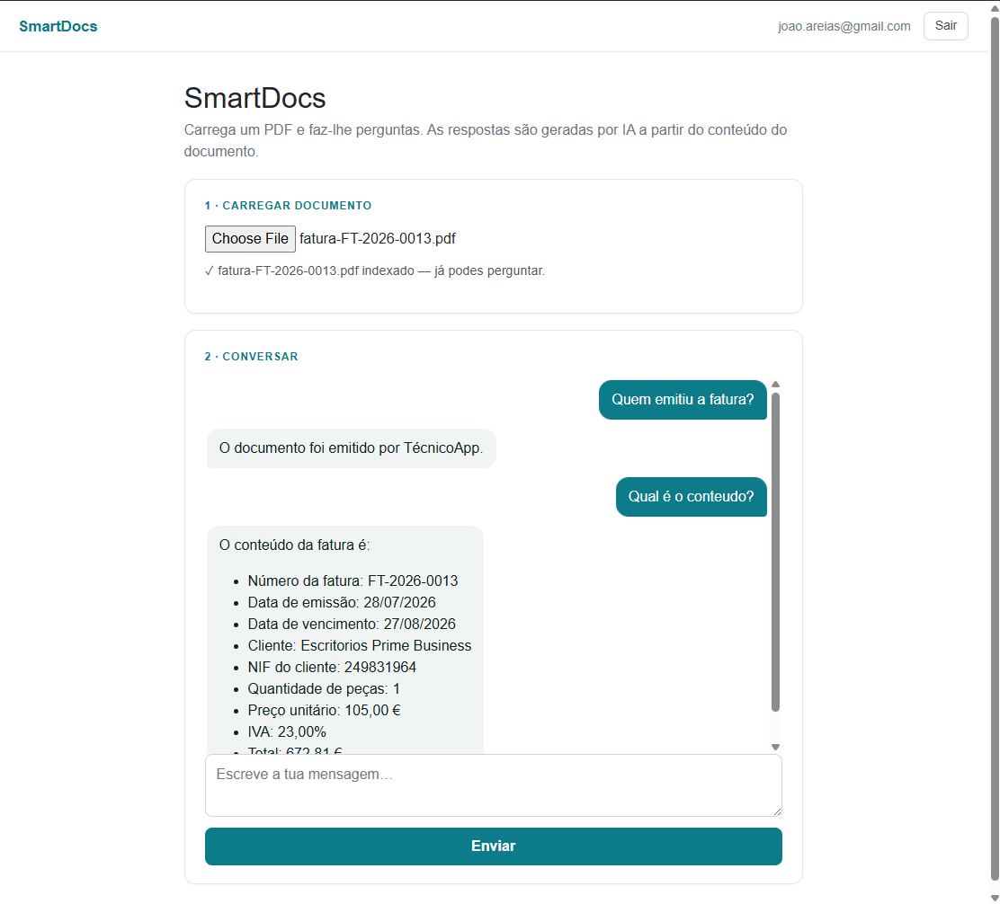
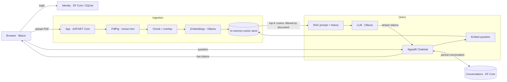

# SmartDocs

**An AI-powered document assistant: upload a PDF, chat with it, and get answers grounded in the document — streamed live, token by token, with conversation memory.**

SmartDocs is a Retrieval-Augmented Generation (RAG) application built with Blazor and .NET. It was developed as a focused portfolio project to work hands-on across a modern AI-enabled web stack: Blazor components, real-time streaming over SignalR, LLM and embedding integration, semantic search, authentication, persisted multi-turn chat, and clean, provider-agnostic service design.



> It runs **fully locally** — no cloud account required. The AI provider (LLM + embeddings) runs on [Ollama](https://ollama.com), but every external dependency sits behind an interface, so switching to Azure OpenAI is a one-line change.

---

## Features

- **PDF upload** with type and size validation, streamed to storage.
- **Text extraction** from the document's text layer (PdfPig).
- **Semantic search** over the document using vector embeddings and cosine similarity.
- **RAG question answering** — retrieved context is grounded into the prompt so answers stay faithful to the source.
- **Real-time streaming** — the model's answer appears live, token by token, via a SignalR streaming hub.
- **Multi-turn chat with memory** — the conversation is persisted per user **and per document**, reloads on return, and prior turns are passed to the model for context.
- **Authentication** — register / login / logout with ASP.NET Core Identity; the app is protected with `[Authorize]`.
- **Polished UI** — custom reusable Blazor components, Markdown-rendered answers (Markdig), a typing indicator, and JS-interop auto-scroll.
- **Provider-agnostic design** — LLM, embeddings and text extraction are all behind interfaces.

---

## Architecture



The app is a single Blazor Web App project organised by responsibility:

| Folder | Responsibility |
| --- | --- |
| `Components/` | Blazor UI — a thin single-page view (`Home.razor`) plus reusable components (`ChatBubble`, `TypingIndicator`) that delegate to services |
| `Components/Account/` | ASP.NET Core Identity pages (login, register, logout) |
| `Services/` | Business logic behind interfaces — extraction, chunking, embeddings, vector store, RAG orchestration, conversation persistence |
| `Hubs/` | `ChatHub` — the SignalR streaming hub |
| `Data/` | `ApplicationDbContext` (Identity + conversations) |
| `Models/` | Domain models (`Document`, `Conversation`, `Message`) |

**Design principle:** the UI and orchestration depend on *interfaces* (`IPdfTextExtractor`, `IEmbeddingService`, `IChatService`, `IDocumentService`), never on concrete providers. Dependencies are wired at the composition root (`Program.cs`), so any provider can be swapped without touching the rest of the code.

---

## Tech stack

| Area | Technology |
| --- | --- |
| Framework | .NET 8+, Blazor Web App (Interactive Server) |
| Real-time | SignalR (streaming hub method + `HubConnection` client) |
| LLM & embeddings | Ollama (local) — `llama3.2:3b`, `nomic-embed-text` — behind interfaces |
| PDF extraction | PdfPig |
| Vector search | In-memory store, cosine similarity, filtered per document |
| Auth & data | ASP.NET Core Identity, Entity Framework Core (SQLite) |
| UI | Custom components, CSS isolation, Markdig (Markdown), JS interop |
| Logging | `ILogger` (structured) |

---

## How it works

**Ingestion (on upload):** the PDF is stored, its text extracted, split into overlapping chunks, embedded into vectors, and indexed (each chunk tagged with its document id).

**Query (on message):** the question is embedded, the top-K most similar chunks **of that document** are retrieved by cosine similarity, those chunks plus the **conversation history** are grounded into a RAG prompt, and the LLM's answer is streamed back to the browser through the SignalR hub in real time. Both the question and the completed answer are persisted to the conversation.

---

## Getting started

### Prerequisites

- [.NET SDK](https://dotnet.microsoft.com/download) (8 or later)
- [Ollama](https://ollama.com) installed and running

### Setup

```bash
# pull the models (embeddings + chat)
ollama pull nomic-embed-text
ollama pull llama3.2:3b

# create the local database (Identity + conversations)
dotnet ef database update --project SmartDocs.Web

# run the app
dotnet run --project SmartDocs.Web
```

Open the URL shown in the console (e.g. `https://localhost:7xxx`), **register an account**, upload a text-based PDF, and start chatting.

### Configuration

`appsettings.json`:

```json
"ConnectionStrings": {
  "DefaultConnection": "Data Source=smartdocs.db"
},
"Ollama": {
  "BaseUrl": "http://localhost:11434",
  "EmbeddingModel": "nomic-embed-text",
  "ChatModel": "llama3.2:3b"
}
```

---

## Design decisions

- **Provider abstraction over concrete SDKs.** Every external capability is behind an interface. The app was developed against a local model (Ollama) and can switch to Azure OpenAI by changing a single DI registration.
- **Explicit SignalR hub for streaming.** Although Blazor Server already runs over SignalR, a dedicated `ChatHub` at `/hubs/chat` demonstrates streaming hub methods (`IAsyncEnumerable`) and keeps the streaming endpoint reusable by other clients.
- **Conversation scoped per user *and* per document.** History and retrieval never bleed across documents.
- **Persist the answer only after the stream completes** — the assistant message is accumulated and saved once, when generation ends.
- **Cheap-path-first extraction.** Text extraction sits behind an interface so a layout-aware/OCR extractor can be added as a fallback without changing the pipeline.
- **Markdown rendered safely.** Model output is rendered with Markdig (HTML escaped by default), avoiding XSS from `MarkupString`.
- **Local-first, cost-free.** The whole stack runs on a developer machine with no cloud dependency or API keys.

---

## Known limitations & roadmap

These are conscious trade-offs for a time-boxed project; the architecture is designed to absorb each next step without a rewrite.

- **Scanned / image-only PDFs** have no text layer and are not read. *Next:* an OCR fallback (Tesseract) or **Azure AI Document Intelligence** for layout- and table-aware extraction — plugs in behind `IPdfTextExtractor`.
- **In-memory vector store** does not persist across restarts and uses brute-force search. *Next:* **Azure Cosmos DB** (vector search) or Azure AI Search — behind the store abstraction.
- **Answer quality on broad "summarise everything" queries** degrades with a small local model and layout-lossy extraction, while specific questions answer accurately. *Next:* a larger model, layout-aware extraction, lower temperature, stricter grounding.
- **No cloud deployment yet.** *Next:* Azure App Service with CI/CD; configuration via app settings + Key Vault (Managed Identity); Microsoft Entra ID for enterprise SSO.

---

*Built as a focused learning project to demonstrate hands-on capability across Blazor, SignalR, RAG, authentication and provider-agnostic .NET service design.*