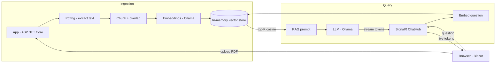

# SmartDocs

**An AI-powered document assistant: upload a PDF, ask questions, get answers grounded in the document — streamed live, token by token.**

SmartDocs is a Retrieval-Augmented Generation (RAG) application built with Blazor and .NET. It was developed as a focused portfolio project to work hands-on across a modern AI-enabled web stack: Blazor components, real-time streaming over SignalR, LLM and embedding integration, semantic search, and clean, provider-agnostic service design.

> It runs **fully locally** — no cloud account required. The AI provider (LLM + embeddings) runs on [Ollama](https://ollama.com), but every external dependency sits behind an interface, so switching to Azure OpenAI is a one-line change.

---

## Features

- **PDF upload** with type and size validation, streamed to storage.
- **Text extraction** from the document's text layer (PdfPig).
- **Semantic search** over the document using vector embeddings and cosine similarity.
- **RAG question answering** — retrieved context is grounded into the prompt so answers stay faithful to the source.
- **Real-time streaming** — the model's answer appears live, token by token, via a SignalR streaming hub.
- **Provider-agnostic design** — LLM, embeddings and text extraction are all behind interfaces.

---

## Architecture



The app is a single Blazor Web App project organised by responsibility:

| Folder | Responsibility |
| --- | --- |
| `Components/` | Blazor UI — a thin single-page view (`Home.razor`) that delegates to services |
| `Services/` | Business logic behind interfaces — extraction, chunking, embeddings, vector store, RAG orchestration |
| `Hubs/` | `ChatHub` — the SignalR streaming hub |
| `Models/` | Domain models |

**Design principle:** the UI and orchestration depend on *interfaces* (`IPdfTextExtractor`, `IEmbeddingService`, `IChatService`, `IDocumentService`), never on concrete providers. Dependencies are wired at the composition root (`Program.cs`), so any provider can be swapped without touching the rest of the code.

---

## Tech stack

| Area | Technology |
| --- | --- |
| Framework | .NET 8, Blazor Web App (Interactive Server) |
| Real-time | SignalR (streaming hub method + `HubConnection` client) |
| LLM & embeddings | Ollama (local) — `llama3.2:3b`, `nomic-embed-text` — behind interfaces |
| PDF extraction | PdfPig |
| Vector search | In-memory store, cosine similarity |
| Logging | `ILogger` (structured) |

---

## How it works

**Ingestion (on upload):** the PDF is stored, its text extracted, split into overlapping chunks, embedded into vectors, and indexed.

**Query (on question):** the question is embedded, the top-K most similar chunks are retrieved by cosine similarity, those chunks are grounded into a RAG prompt, and the LLM's answer is streamed back to the browser through the SignalR hub in real time.

---

## Getting started

### Prerequisites

- [.NET 8 SDK](https://dotnet.microsoft.com/download)
- [Ollama](https://ollama.com) installed and running

### Setup

```bash
# pull the models (embeddings + chat)
ollama pull nomic-embed-text
ollama pull llama3.2:3b

# run the app
dotnet run --project SmartDocs.Web
```

Then open the URL shown in the console (e.g. `https://localhost:7xxx`), upload a text-based PDF, and ask a question.

### Configuration

`appsettings.json`:

```json
"Ollama": {
  "BaseUrl": "http://localhost:11434",
  "EmbeddingModel": "nomic-embed-text",
  "ChatModel": "llama3.2:3b"
}
```

---

## Design decisions

- **Provider abstraction over concrete SDKs.** Every external capability is behind an interface. The app was developed against a local model (Ollama) and can switch to Azure OpenAI by changing a single DI registration.
- **Explicit SignalR hub for streaming.** Although Blazor Server already runs over SignalR, a dedicated `ChatHub` at `/hubs/chat` demonstrates streaming hub methods and keeps the streaming endpoint reusable by other clients.
- **Cheap-path-first extraction.** Text extraction is designed so a layout-aware/OCR extractor can be added as a fallback without changing the pipeline.
- **Local-first, cost-free.** The whole stack runs on a developer machine with no cloud dependency or API keys.

---

## Known limitations & roadmap

These are conscious trade-offs for a time-boxed project; the architecture is designed to absorb each next step without a rewrite.

- **Scanned / image-only PDFs** have no text layer and are not read. *Next:* an OCR fallback (Tesseract) or **Azure AI Document Intelligence** for layout- and table-aware extraction — plugs in behind `IPdfTextExtractor`.
- **In-memory vector store** does not persist and uses brute-force search. *Next:* **Azure Cosmos DB** (vector search) or Azure AI Search — behind the store abstraction.
- **Answer quality on broad "summarise everything" queries** degrades with a small local model and layout-lossy extraction, while specific questions answer accurately. *Next:* a larger model, layout-aware extraction, lower temperature, stricter grounding.
- **No authentication yet.** *Next:* ASP.NET Core Identity, or Microsoft Entra ID for enterprise SSO.
- **No cloud deployment yet.** *Next:* Azure App Service with CI/CD; configuration via app settings + Key Vault (Managed Identity).

---

*Built as a focused learning project to demonstrate hands-on capability across Blazor, SignalR, RAG and provider-agnostic .NET service design.*